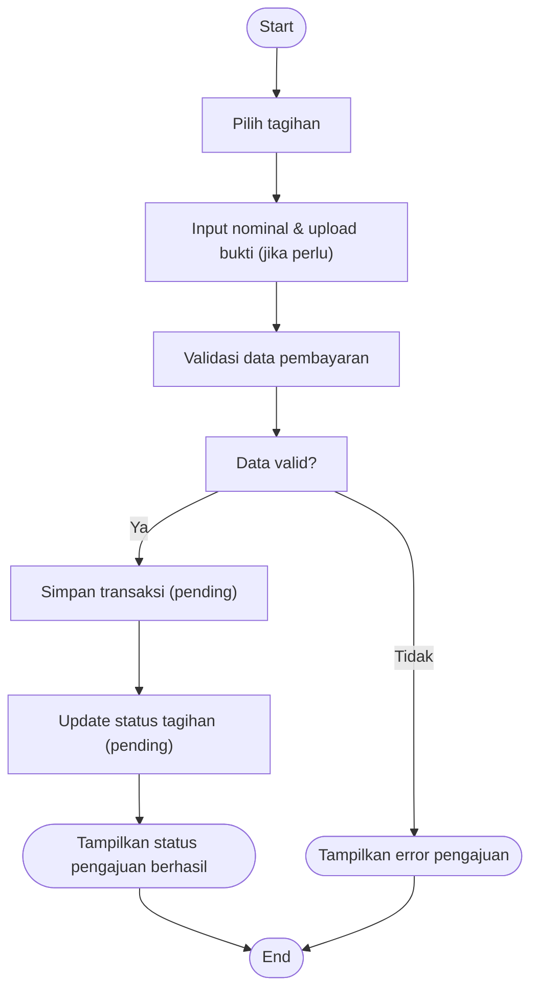

# Activity Diagram — Ajukan Pembayaran (Santri)

Diagram berikut menggambarkan alur aktivitas pada proses santri mengajukan pembayaran tagihan pada sistem Santri Pay.

## Penjelasan
- Santri memilih tagihan, input nominal/bukti, sistem validasi data.
- Jika valid, simpan transaksi & update status tagihan, tampilkan status berhasil. Jika tidak valid, tampilkan error.

---

### Kode Mermaid
