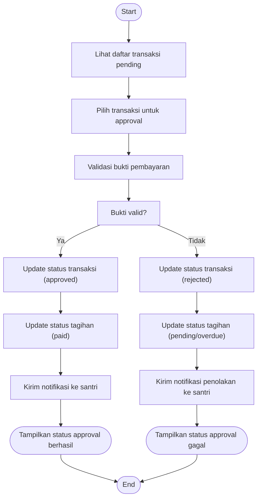

# Activity Diagram — Approval Pembayaran (Admin)

Diagram berikut menggambarkan alur aktivitas pada proses approval pembayaran oleh Admin pada sistem Santri Pay.

## Penjelasan
- Admin melihat daftar transaksi, memilih transaksi, validasi bukti pembayaran.
- Jika valid, update status transaksi & tagihan, kirim notifikasi sukses ke santri. Jika tidak valid, update status rejected, kirim notifikasi gagal.

---

### Kode Mermaid
