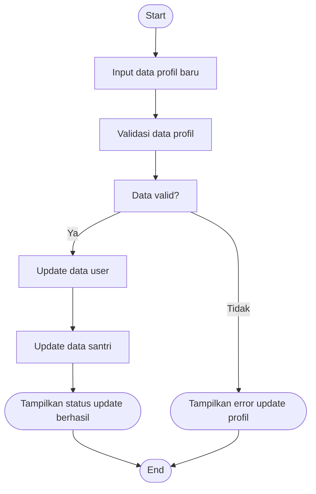

# Activity Diagram — Edit Profil (Santri)

Diagram berikut menggambarkan alur aktivitas pada proses edit profil oleh Santri pada sistem Santri Pay.

## Penjelasan
- Santri input data profil baru, sistem validasi data.
- Jika valid, update data user & santri, tampilkan status berhasil. Jika tidak valid, tampilkan error.

---

### Kode Mermaid
