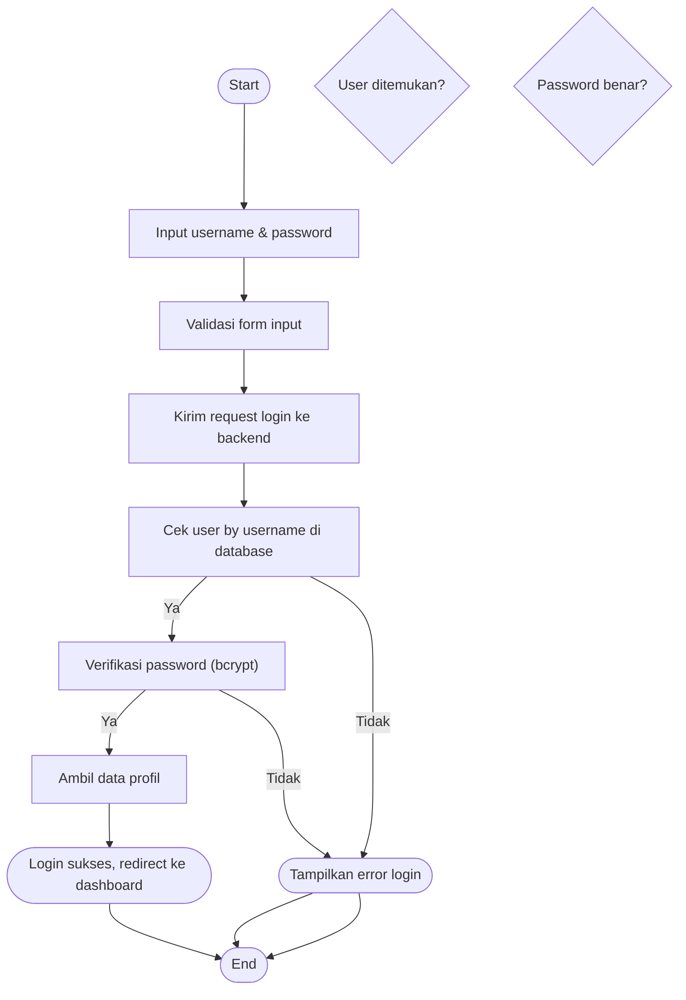

# Activity Diagram — Login

Diagram berikut menggambarkan alur aktivitas pada proses login (Santri/Admin) pada sistem Santri Pay.

## Penjelasan
- User mengisi form login, sistem validasi input, cek user di database, verifikasi password.
- Jika sukses, ambil profil dan redirect ke dashboard. Jika gagal, tampilkan error.

---

### Kode Mermaid
