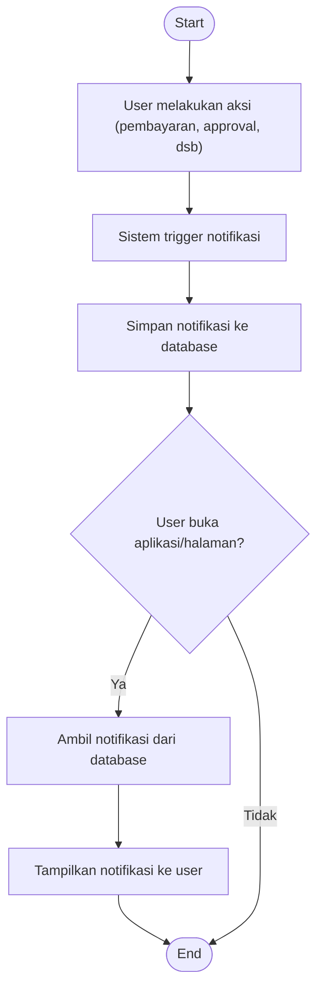

# Activity Diagram — Notifikasi (Trigger & Delivery)

Diagram berikut menggambarkan alur aktivitas pada proses trigger dan pengiriman notifikasi pada sistem Santri Pay.

## Penjelasan
- Setiap aksi penting akan trigger notifikasi di backend dan disimpan ke database.
- Saat user membuka aplikasi/halaman, sistem mengambil dan menampilkan notifikasi.

---

### Kode Mermaid
