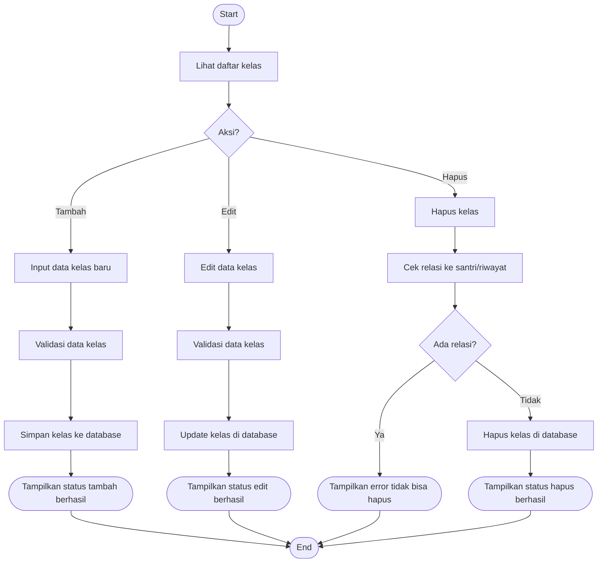

# Activity Diagram — Pengelolaan Kelas

Diagram berikut menggambarkan alur aktivitas pada proses pengelolaan kelas oleh Admin pada sistem Santri Pay.

## Penjelasan
- Admin dapat menambah, edit, hapus kelas.
- Hapus kelas dicek relasinya ke santri/riwayat, jika ada relasi tidak bisa dihapus.

---

### Kode Mermaid
