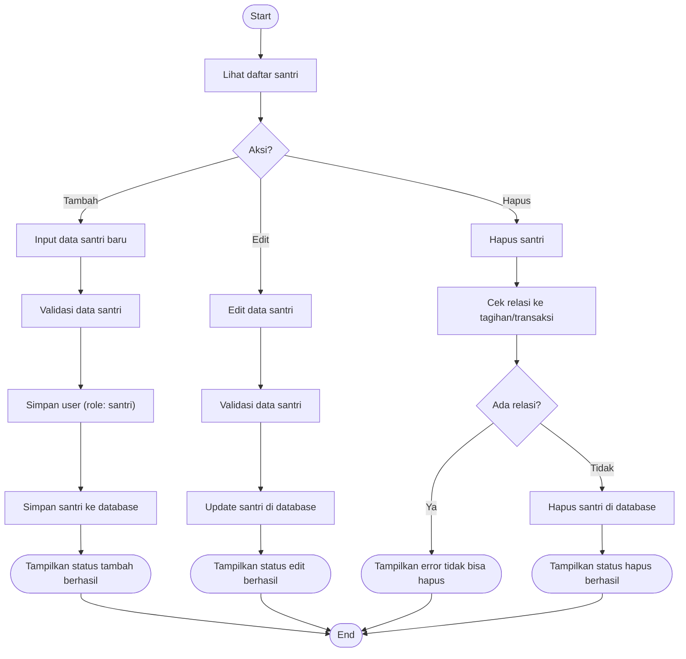

# Activity Diagram — Pengelolaan Santri

Diagram berikut menggambarkan alur aktivitas pada proses pengelolaan santri oleh Admin pada sistem Santri Pay.

## Penjelasan
- Admin dapat menambah, edit, hapus santri.
- Hapus santri dicek relasinya ke tagihan/transaksi, jika ada relasi tidak bisa dihapus.

---

### Kode Mermaid
