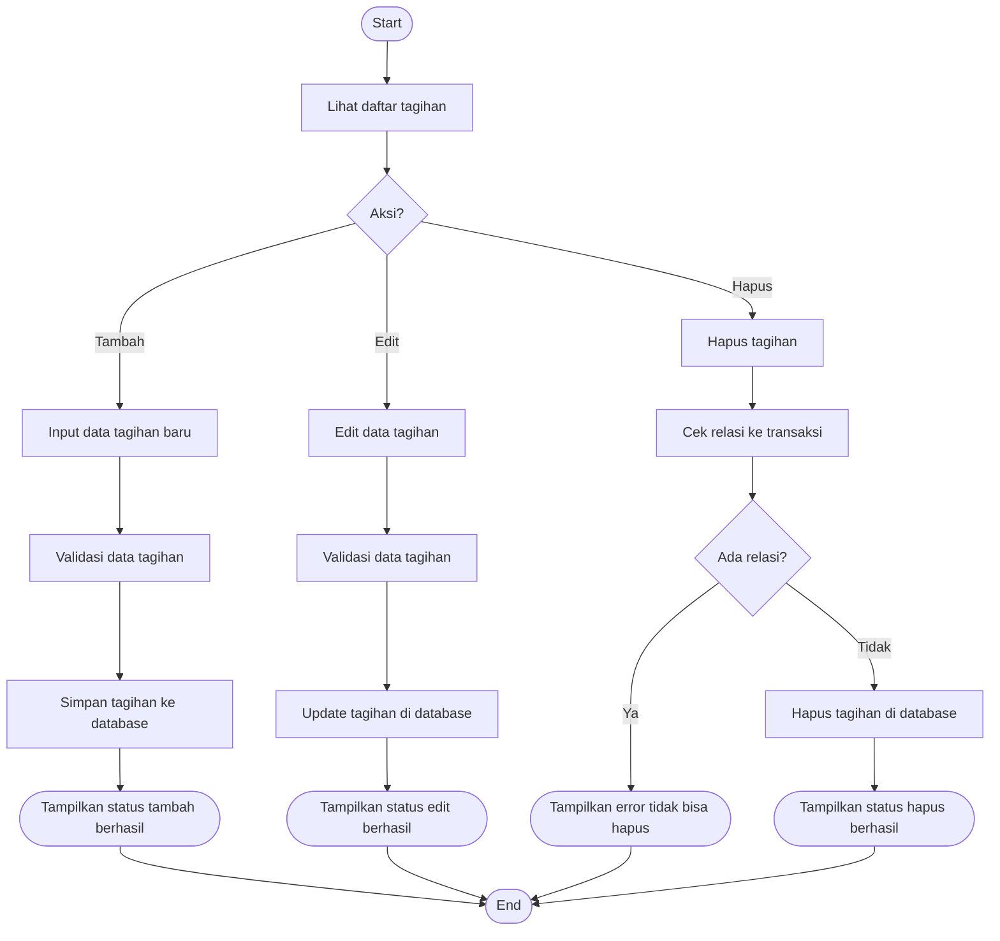

# Activity Diagram — Pengelolaan Tagihan

Diagram berikut menggambarkan alur aktivitas pada proses pengelolaan tagihan oleh Admin pada sistem Santri Pay.

## Penjelasan
- Admin dapat menambah, edit, hapus tagihan.
- Hapus tagihan dicek relasinya ke transaksi, jika ada relasi tidak bisa dihapus.

---

### Kode Mermaid
