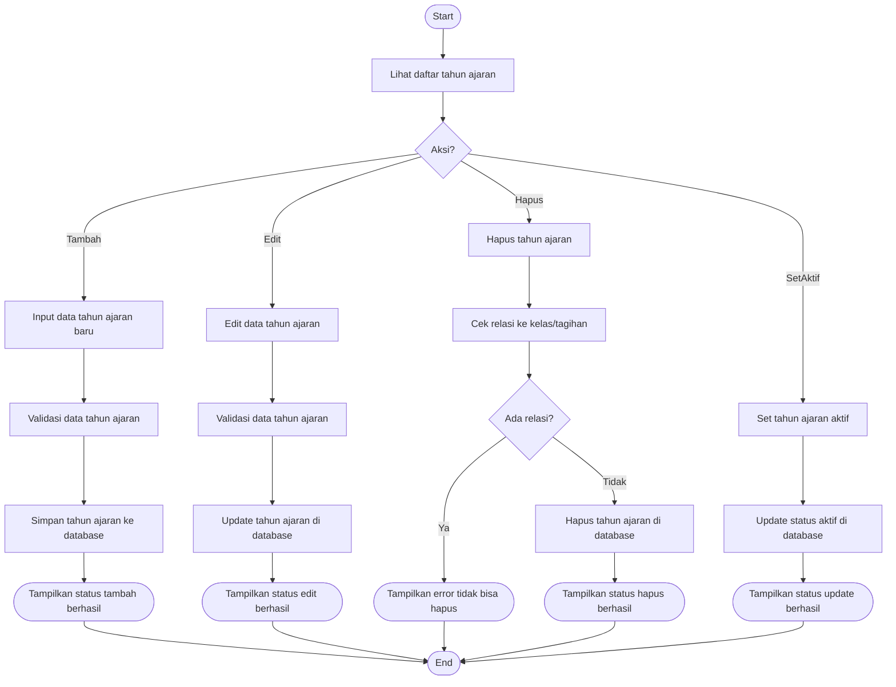

# Activity Diagram — Pengelolaan Tahun Ajaran

Diagram berikut menggambarkan alur aktivitas pada proses pengelolaan tahun ajaran oleh Admin pada sistem Santri Pay.

## Penjelasan
- Admin dapat menambah, edit, hapus, dan set tahun ajaran aktif.
- Hapus tahun ajaran dicek relasinya ke kelas/tagihan, jika ada relasi tidak bisa dihapus.

---

### Kode Mermaid
