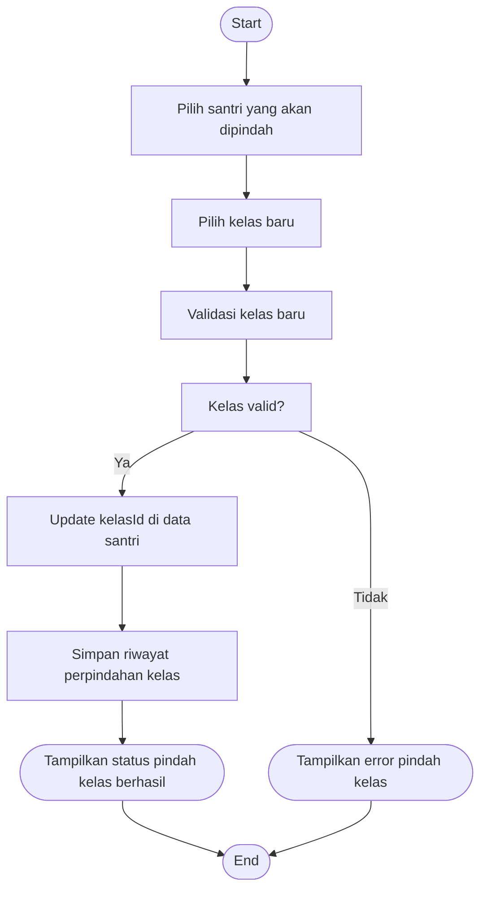

# Activity Diagram — Pindah Kelas (Admin)

Diagram berikut menggambarkan alur aktivitas pada proses pindah kelas santri oleh Admin pada sistem Santri Pay.

## Penjelasan
- Admin memilih santri & kelas baru, sistem validasi kelas.
- Jika valid, update kelasId di santri, simpan riwayat, tampilkan status berhasil. Jika tidak valid, tampilkan error.

---

### Kode Mermaid
