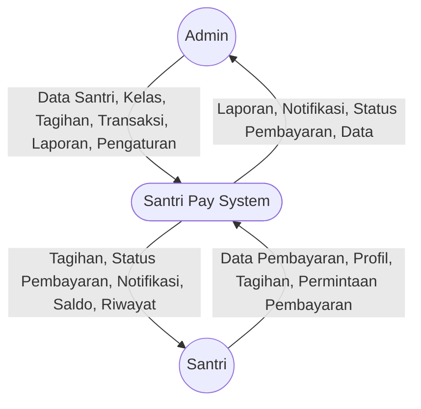

# DFD Level 0 (Context Diagram) — Santri Pay

Diagram berikut menggambarkan konteks utama sistem Santri Pay, aktor eksternal, dan aliran data utama pada level paling atas.

## Penjelasan
- **Admin**: Mengelola data, memantau transaksi, mengatur sistem, menerima laporan & notifikasi.
- **Santri**: Melihat tagihan, mengajukan pembayaran, mengelola profil, menerima notifikasi & status pembayaran.
- **System**: Santri Pay sebagai pusat pemrosesan data dan layanan.

---

### Kode Mermaid
