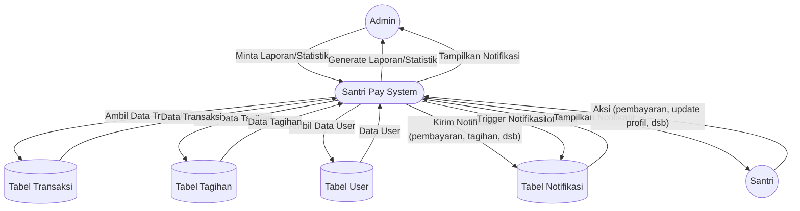

# DFD Level 1 — Laporan & Notifikasi

Diagram berikut menggambarkan detail aliran data untuk proses laporan dan notifikasi pada sistem Santri Pay.

## Penjelasan
- **Admin** meminta laporan/statistik, sistem mengambil data dan menghasilkan laporan.
- **System** mengirim notifikasi ke admin/santri berdasarkan aksi (pembayaran, tagihan, dsb).
- **Notifikasi** disimpan di tabel Notifikasi dan ditampilkan ke user terkait.

---

### Kode Mermaid
