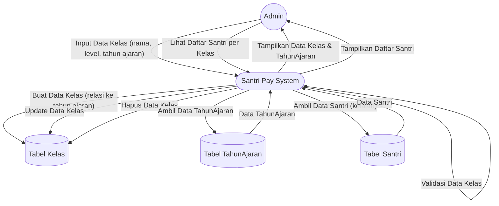

# DFD Level 1 — Manajemen Data Kelas

Diagram berikut menggambarkan detail aliran data untuk proses manajemen data kelas oleh Admin pada sistem Santri Pay.

## Penjelasan
- **Admin** menginput, mengedit, menghapus, dan melihat data kelas.
- **System** melakukan validasi, update ke tabel Kelas, relasi ke TahunAjaran, dan menampilkan daftar santri per kelas.

---

### Kode Mermaid
