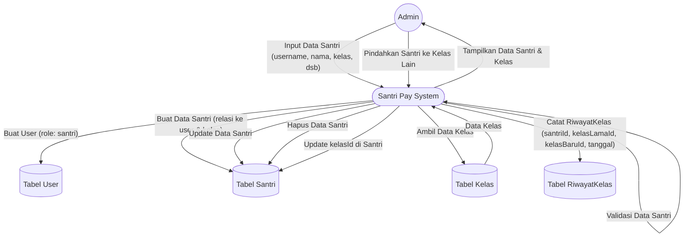

# DFD Level 1 — Manajemen Data Santri

Diagram berikut menggambarkan detail aliran data untuk proses manajemen data santri oleh Admin pada sistem Santri Pay.

## Penjelasan
- **Admin** menginput, mengedit, menghapus, dan memindahkan santri.
- **System** melakukan validasi, update ke tabel User, Santri, Kelas, dan RiwayatKelas.
- **RiwayatKelas** mencatat perpindahan kelas santri.

---

### Kode Mermaid
