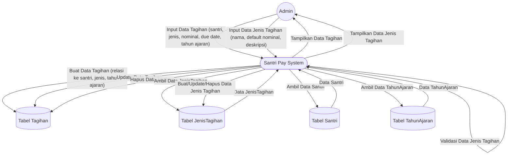

# DFD Level 1 — Manajemen Tagihan & Jenis Tagihan

Diagram berikut menggambarkan detail aliran data untuk proses manajemen tagihan dan jenis tagihan oleh Admin pada sistem Santri Pay.

## Penjelasan
- **Admin** menginput, mengedit, menghapus tagihan dan jenis tagihan.
- **System** melakukan validasi, update ke tabel Tagihan, JenisTagihan, dan relasi ke Santri & TahunAjaran.

---

### Kode Mermaid
