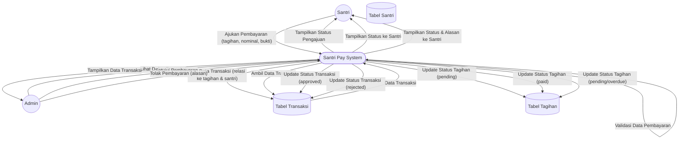

# DFD Level 1 — Manajemen Transaksi Pembayaran

Diagram berikut menggambarkan detail aliran data untuk proses manajemen transaksi pembayaran pada sistem Santri Pay.

## Penjelasan
- **Santri** mengajukan pembayaran, sistem memvalidasi dan mencatat transaksi.
- **Admin** memantau, menyetujui, atau menolak transaksi pembayaran.
- **System** mengupdate status transaksi dan tagihan, serta menampilkan status ke santri.

---

### Kode Mermaid
