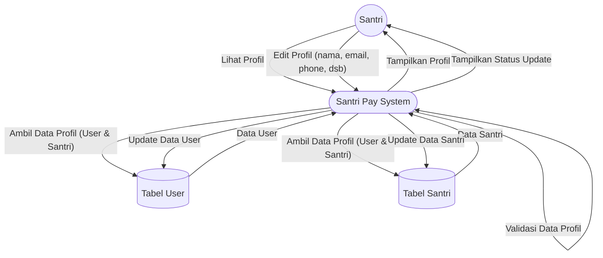

# DFD Level 1 — Manajemen Profil Santri

Diagram berikut menggambarkan detail aliran data untuk proses manajemen profil santri pada sistem Santri Pay.

## Penjelasan
- **Santri** melihat dan mengedit data profilnya.
- **System** mengambil dan mengupdate data di tabel User & Santri, serta menampilkan hasil ke santri.

---

### Kode Mermaid
