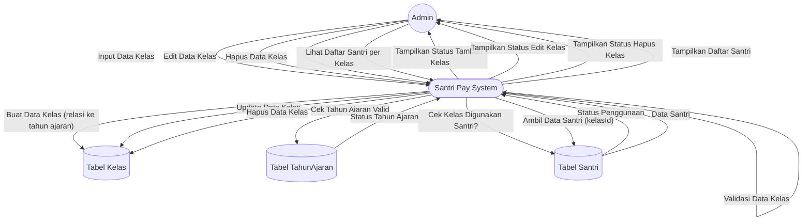

# DFD Level 2 — Manajemen Data Kelas

Diagram berikut menggambarkan detail subproses pada manajemen data kelas (tambah, edit, hapus, lihat daftar santri per kelas).

## Penjelasan
- **Tambah/Edit Kelas:** Melibatkan validasi nama & tahun ajaran, update ke tabel Kelas.
- **Hapus Kelas:** Cek apakah kelas digunakan oleh santri sebelum dihapus.
- **Lihat Daftar Santri:** Ambil data santri berdasarkan kelasId.

---

### Kode Mermaid
