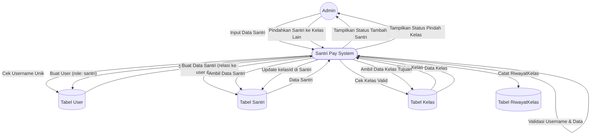

# DFD Level 2 — Manajemen Data Santri

Diagram berikut menggambarkan detail subproses pada manajemen data santri (contoh: tambah santri dan pindah kelas).

## Penjelasan
- **Tambah Santri:** Melibatkan validasi username, cek kelas, pembuatan user & santri.
- **Pindah Kelas:** Melibatkan cek data santri, cek kelas tujuan, update kelasId, dan catat riwayat.

---

### Kode Mermaid
