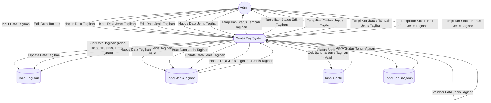

# DFD Level 2 — Manajemen Tagihan & Jenis Tagihan

Diagram berikut menggambarkan detail subproses pada manajemen tagihan dan jenis tagihan (tambah, edit, hapus tagihan dan jenis tagihan).

## Penjelasan
- **Tambah/Edit/Hapus Tagihan:** Melibatkan validasi data, cek santri, jenis tagihan, tahun ajaran, dan update ke tabel Tagihan.
- **Tambah/Edit/Hapus Jenis Tagihan:** Melibatkan validasi data dan update ke tabel JenisTagihan.

---

### Kode Mermaid
