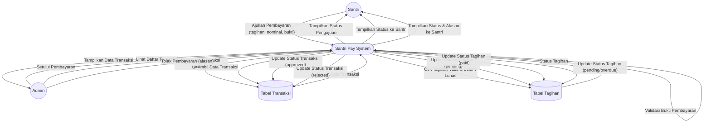

# DFD Level 2 — Manajemen Transaksi Pembayaran

Diagram berikut menggambarkan detail subproses pada manajemen transaksi pembayaran (ajukan pembayaran, approval, reject).

## Penjelasan
- **Ajukan Pembayaran:** Melibatkan validasi data, cek tagihan, simpan transaksi, update status tagihan.
- **Approval/Reject:** Admin memvalidasi, mengubah status transaksi & tagihan, dan menampilkan hasil ke santri.

---

### Kode Mermaid
