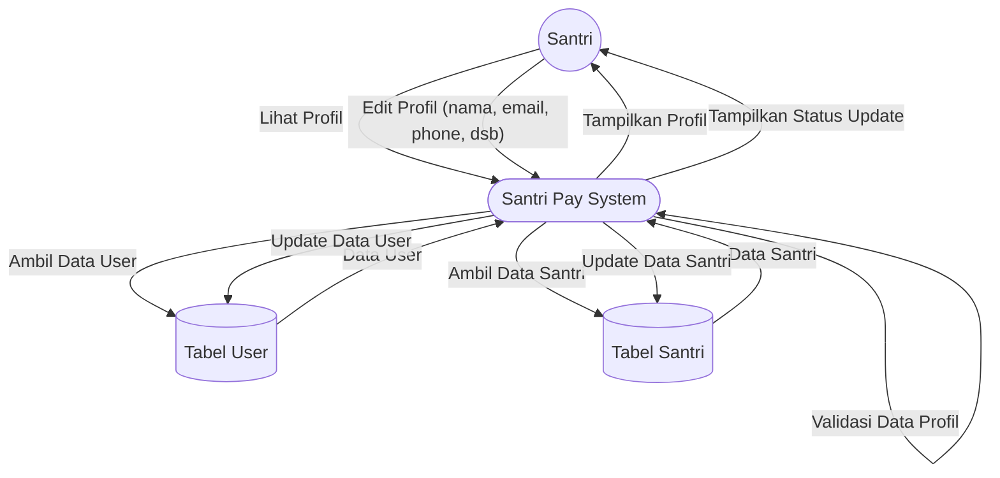

# DFD Level 2 — Manajemen Profil Santri

Diagram berikut menggambarkan detail subproses pada manajemen profil santri (lihat & edit profil).

## Penjelasan
- **Lihat Profil:** Sistem mengambil data user & santri lalu menampilkannya ke santri.
- **Edit Profil:** Sistem memvalidasi, mengupdate data user & santri, lalu menampilkan status ke santri.

---

### Kode Mermaid
