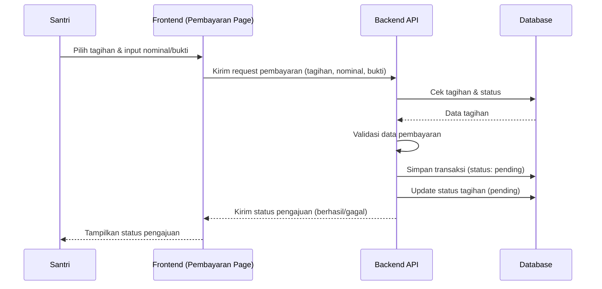

# Sequence Diagram — Ajukan Pembayaran (Santri)

Diagram berikut menggambarkan urutan interaksi pada proses santri mengajukan pembayaran tagihan pada sistem Santri Pay.

## Penjelasan
- Santri memilih tagihan, mengisi nominal/bukti, frontend mengirim ke backend.
- Backend cek tagihan, validasi data, simpan transaksi, update status tagihan.
- Status pengajuan dikirim ke santri.

---

### Kode Mermaid
