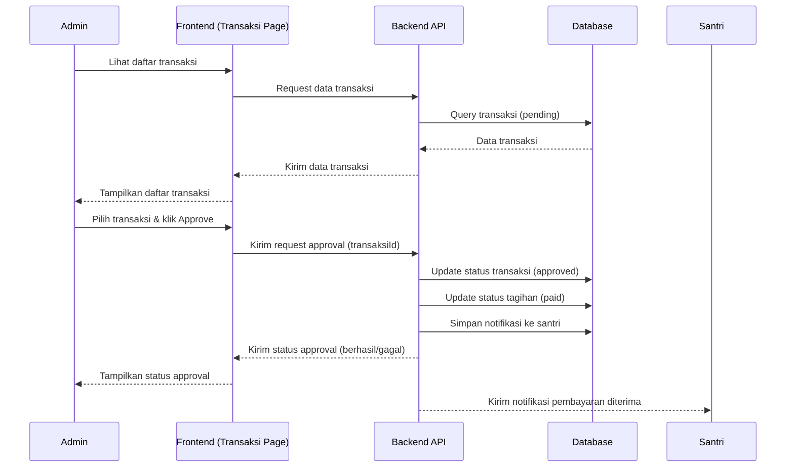

 # Sequence Diagram — Approval Pembayaran (Admin)

Diagram berikut menggambarkan urutan interaksi pada proses approval pembayaran oleh Admin pada sistem Santri Pay.

## Penjelasan
- Admin melihat daftar transaksi, memilih transaksi, dan melakukan approval.
- Backend update status transaksi & tagihan, simpan notifikasi ke santri, dan mengirim status ke admin & santri.

---

### Kode Mermaid

