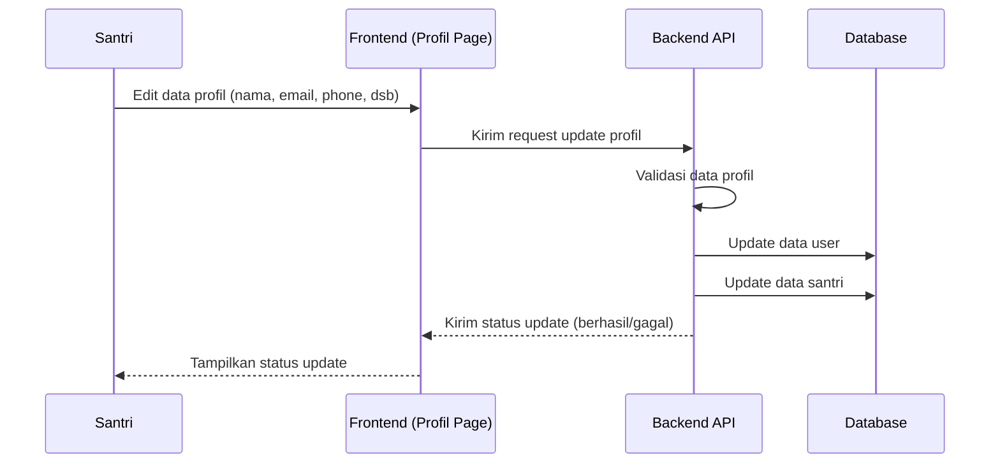

# Sequence Diagram — Edit Profil (Santri)

Diagram berikut menggambarkan urutan interaksi pada proses edit profil oleh Santri pada sistem Santri Pay.

## Penjelasan
- Santri mengedit data profil, frontend mengirim ke backend.
- Backend validasi data, update tabel user & santri, kirim status ke frontend.

---

### Kode Mermaid
