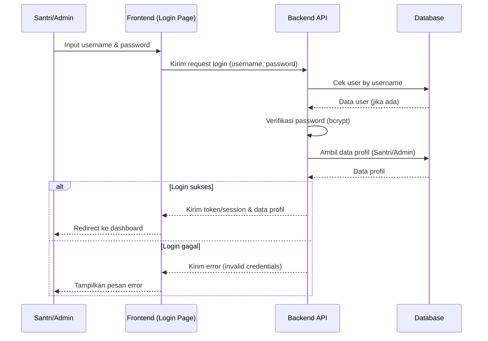

# Sequence Diagram — Login (Santri/Admin)

Diagram berikut menggambarkan urutan interaksi pada proses login oleh Santri/Admin pada sistem Santri Pay.

## Penjelasan
- User mengisi form login, frontend mengirim ke backend.
- Backend cek user, verifikasi password, ambil data profil.
- Jika sukses, kirim session/token dan redirect ke dashboard. Jika gagal, tampilkan error.

---

### Kode Mermaid
