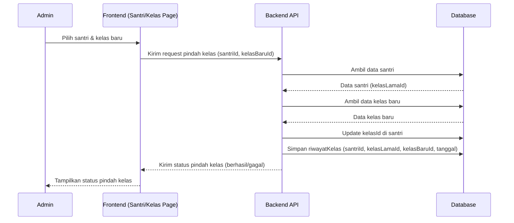

# Sequence Diagram — Pindah Kelas (Admin)

Diagram berikut menggambarkan urutan interaksi pada proses pindah kelas santri oleh Admin pada sistem Santri Pay.

## Penjelasan
- Admin memilih santri dan kelas baru, frontend mengirim ke backend.
- Backend ambil data santri & kelas, update kelasId, simpan riwayatKelas, dan kirim status ke admin.

---

### Kode Mermaid
