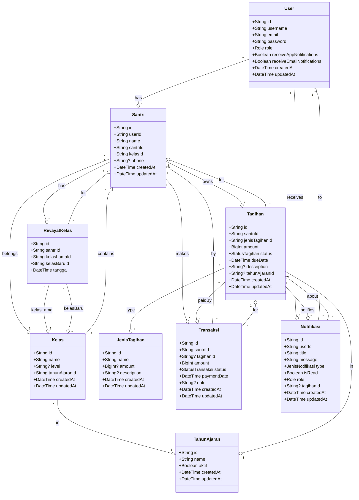

# UML Class Diagram Santri Pay

Diagram berikut menggambarkan struktur utama database dan relasi antar entitas pada sistem Santri Pay.

## Penjelasan Relasi Utama
- **User ↔ Santri:** Satu user (role santri) memiliki satu data santri.
- **Santri ↔ Kelas:** Santri tergabung dalam satu kelas, satu kelas berisi banyak santri.
- **Santri ↔ Tagihan/Transaksi:** Satu santri bisa memiliki banyak tagihan dan transaksi.
- **Tagihan ↔ JenisTagihan:** Setiap tagihan punya satu jenis (kategori).
- **Tagihan ↔ Transaksi:** Satu tagihan bisa dibayar lewat beberapa transaksi.
- **Notifikasi:** Dikirim ke user, bisa terkait tagihan.
- **RiwayatKelas:** Mencatat perpindahan kelas santri.

> Diagram ini dapat divisualisasikan dengan Mermaid Live Editor atau tools serupa. 